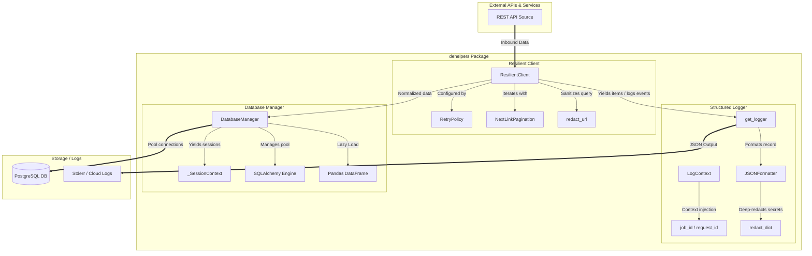

# Architecture

This document explains the design philosophy, module structure, and data flow of `dehelpers`.

---

## Design Philosophy

Three principles guided every decision:

### 1. Small is better

`dehelpers` is not a framework. It is a thin layer of opinionated glue on top of proven libraries. A developer should be able to read the entire source code in under thirty minutes and understand exactly what happens at every step.

### 2. Production-aware defaults

Code that works on a laptop is not necessarily ready for production. Real systems encounter network failures, database restarts, and rate limits without warning. Rather than requiring developers to configure dozens of options before getting started, `dehelpers` ships sensible defaults:

- Bounded retries with exponential backoff and jitter
- Explicit per-request timeouts (connect + read)
- A wall-clock `total_timeout` to prevent infinite retry loops
- Connection pooling with pre-ping health checks
- Automatic rollback on transaction failure

Every default can be overridden, but the library is useful out of the box.

### 3. Security should not depend on memory

One forgotten log statement can expose an API key, a bearer token, or a database password. Instead of trusting developers to remember what not to log, `dehelpers` applies deep recursive redaction to every log record and URL before it reaches output. Security is the default, not an afterthought.

---

## Module Structure

| Module | File | Responsibility |
|---|---|---|
| **Resilient Client** | `api.py` | HTTP requests, retries, backoff, jitter, pagination, URL redaction |
| **Database Manager** | `db.py` | PostgreSQL connections, pooling, transactions, optional DataFrame output |
| **Structured Logger** | `logger.py` | JSON formatting, context injection (`job_id`, `request_id`), secret redaction |
| **Redaction Utilities** | `_redact.py` | Shared deep-redaction logic for dicts and URLs |
| **Exceptions** | `exceptions.py` | Centralised exception hierarchy (`DPHError` base) |

Each module solves exactly one problem. Nothing more.

---

## Architecture Diagram



---

## Data Flow

A typical `dehelpers` pipeline follows this path:

1. **`ResilientClient`** sends an HTTP request to an external API. If the request fails with a retryable status (429, 500, 502, 503, 504) or a connection error, it waits using exponential backoff with jitter and retries up to `max_retries` times. A wall-clock `total_timeout` prevents infinite retry loops.

2. The URL and any query parameters containing sensitive keys are **redacted** before they appear in log output. The response data is returned to the caller (or yielded item-by-item via `paginate()`).

3. **`get_logger`** formats every log record as a single JSON line and writes it to `stderr`. All `extra` fields pass through `redact_dict()` before serialization. `LogContext` uses Python's `contextvars` to inject `job_id` and `request_id` into every record within its scope.

4. **`DatabaseManager`** opens a SQLAlchemy engine with connection pooling. Each call to `session()` yields a context-managed `Session` that auto-commits on clean exit and auto-rolls-back on exception. Connections are health-checked (`pool_pre_ping=True`) before checkout and recycled every 1800 seconds.

---

## Exception Hierarchy

```
DPHError
├── RetryError        ← all retry attempts exhausted or total_timeout exceeded
├── PaginationError   ← failure during paginated fetching (carries partial results)
└── DatabaseError     ← SQLAlchemy or driver-level failure
```

All exceptions inherit from `DPHError`, so you can catch any `dehelpers` error with a single `except DPHError` clause. Original exceptions are always preserved as `__cause__`.

---

## Boundaries

Here is exactly what this package **is** and what it **is not**:

| Layer | What this IS | What this IS NOT |
|---|---|---|
| **API / HTTP** | A retry-protected wrapper around `requests.Session` with exponential backoff, jitter, and simple pagination. | An async library (`aiohttp`, `httpx`), a GraphQL client, or a full HTTP client replacement. |
| **Database** | A thread-safe connection manager for PostgreSQL with pooling, transactions, and lazy DataFrame output. | An ORM (`SQLModel`, `SQLAlchemy ORM`), a migration tool (`Alembic`), or a DB admin tool. |
| **Logging** | A zero-dependency structured JSON formatter on stdlib `logging` with automatic deep secret redaction. | A log router (`Fluentd`, `Logstash`), a file logger, or a metrics exporter. |
| **Execution** | Designed for batch environments: Airflow tasks, ETL scripts, Docker containers. | Not suitable for high-throughput real-time web servers or async microservices. |

---

## Dependency Graph

```
dehelpers
├── requests ≥ 2.28
├── sqlalchemy ≥ 2.0
├── psycopg[binary] ≥ 3.0
└── (optional) pandas ≥ 2.0  [dataframe extra]
```

No other runtime dependencies. The logger and redaction modules use only the Python standard library.
